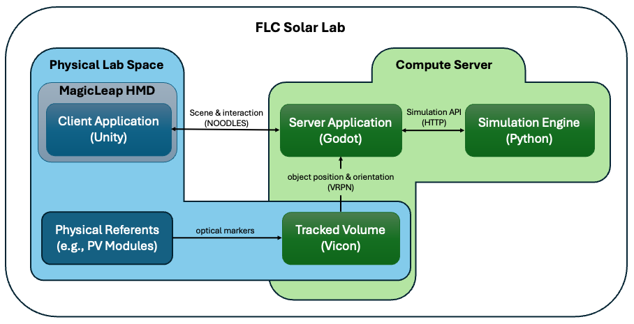
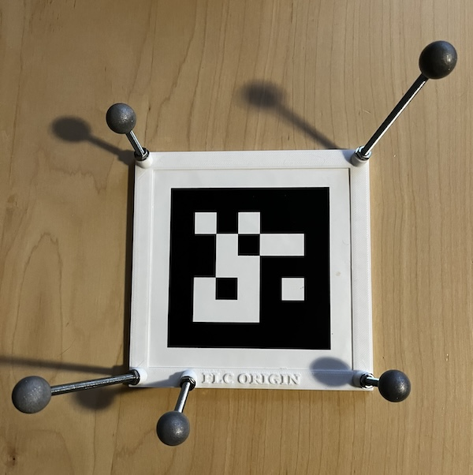

# Immersive Digital Twin Laboratory for Engineering Education -- System Documentation

##  1. Overview

This document provides an in-depth overview of the FLC Solar Lab design
and usage, describing the system components, software architecture, key
features, and walks through an example use case of the system. The FLC
Solar Lab system is designed to provide the hardware and software
infrastructure for integrating digital twin simulations with physical
objects in a laboratory setting. This integration enables the
synchronization between the physical and digital realms, leveraging
extended reality (XR) technologies to enhance interactivity,
visualization, and educational experiences.

The system’s hardware infrastructure includes high-precision motion
tracking, head-mounted displays (HMDs), and user-defined physical
referents. Together, these components can be used to create a dynamic
and immersive applications where users can manipulate physical objects
to interact with digital twin simulations. The software infrastructure
facilitates synchronization and interaction between physical assets and
their virtual counterparts. It supports cross-platform communication
using the NOODLES protocol and built with flexible frameworks like Unity
and Godot to lower the barrier to entry to less experienced developers.

### Repositories
#### Client (HMD) Application
- [HMDClient](https://github.com/FLC-Solar-Lab/HMDClient.git) Magic Leap 2 Unity client, It serves as a generic NOODLES client, providing interaction between the headsets and the
broader system infrastructure.

#### Full Server Applications
- [IrradianceSim](https://github.com/FLC-Solar-Lab/IrradianceSim) a minimally complete demonstration, integrating real-time simulation of surface irradiance on physical referents from a virutal sun. 
- [FLCPVPanel](https://github.com/FLC-Solar-Lab/FLCPVPanel) a more sophisticated digital twin proof-of-concept demonstration, providing an interactive visualization of power flow in selected PV modules based on physical orientation, shading, and other enviromental factors.
    - [pvpanelsim](https://github.com/FLC-Solar-Lab/pvpanelsim) Digital twin submodule based on pvlib and pvmismatch
- [FLCHouse](https://github.com/FLC-Solar-Lab/FLCHouse) a more sophisticated digital twin proof-of-concept demonstration, 
providing the ability to manipulate solar panel layout on an interactive architectural model. This hands-on demonstration allows students to explore real-world considerations for solar installation, including panel orientation and shading effects.
    - [pvpanelsim](https://github.com/FLC-Solar-Lab/pvpanelsim) Digital twin submodule based on pvlib and pvmismatch
    - [HouseSensing](https://github.com/FLC-Solar-Lab/HouseSensing) Raspberry Pi micropython code and hardware schematics used to detect the presence of physical PV module models on the architecutral-scale house using a Pi Pico W and Hall Sensors.
- [MagnetSim](https://github.com/FLC-Solar-Lab/DevelopmentTutorial) is a tutorial repository to walk users through the development of a FLC Solar Lab application, creating a real-time simulation of force between two volumetric magnets.

#### Server Application Template
- [FLCServerTemplate](https://github.com/FLC-Solar-Lab/FLCServerTemplate) is a foundational repository designed to streamline the development of FLC Solar Lab applications, providing a structured base for integrating real-time visualizations with scientific simulations, supporting synchronization between physical and digital environments.

#### Backend code
- [noodles_server](https://github.com/FLC-Solar-Lab/noodles_server) a Godot server library implements the NOODLES messaging protocol and provides objects for maintaining a scene in state. The server uses a websocket connection to send CBOR encoded messages. To customize its implementation, the library provides convenient interface methods to assist the user in writing their own methods for the server. The user can also add custom delegates to add additional functionality to any of the standard components.

#### Physical assets

- [markers](https://github.com/FLC-Solar-Lab/markers) VRPN and ARuCO markers for the FLC Solar Lab.

## 2. Physical Components

### Whole Room Tracking

The Vicon motion capture system is a high-precision optical tracking
solution that uses multiple cameras and reflective markers to track the
position and orientation of objects in real-time within a defined lab
space. This system is critical for integrating physical objects with
their digital twins in mixed-reality applications, providing
sub-millimeter accuracy and six degrees of freedom (6-DOF) tracking.

#### **How the System Tracks Objects**

1.  **Cameras and Markers:**

    -   The Vicon system uses an array of infrared cameras to detect
        reflective optical markers placed on objects.

    -   The system identifies the position of each marker in 3D space by
        triangulating their positions from multiple camera views.

2.  **Tracking Volume:**

    -   The cameras are calibrated to define a 3D tracking volume,
        ensuring accurate tracking of objects and users within the
        laboratory space.

    -   The Vicon Tracker calibration process determines the physical
        positions, orientations, and lens properties of each camera by
        tracking the Vicon calibration object, throughout the capture
        volume. This process defines the global coordinate system,
        setting the volume origin and axes (x, y, z). TODO: Specifics of
        setting FLC Origin (arbitrary now?)

3.  **Object Definition:**

    -   Custom objects can be defined by fixing at least four or more
        reflective markers in a unique, asymmetric configuration. This
        ensures that the system can identify and distinguish the object
        from other tracked items in the environment.

    

    

    Tutorial: Creating a Custom Tracked Object Using Vicon Tracker Software
    

        To integrate a new physical object into the system, follow these steps
        using **Vicon Tracker**:

        1.  **Prepare the Object:**

            -   Affix **four or more reflective markers** to the object in
                an **asymmetric pattern** (i.e., not forming a straight line or
                a symmetric shape).

            -   Ensure that the markers are securely attached and visible to the
                cameras from multiple angles.

            -   coverage and accuracy.

        2.  **Define a New Object in Tracker Software:**

            -   Launch the **Vicon Tracker** software.

            -   Place the object with markers in the tracking volume.

            -   Go to the **Objects Tab** and click **Create New Object**.

            -   Select the visible markers and associate them with the new
                object. Assign the object a **unique name** (e.g.,
                *Object\_Name0*) for identification.

        3.  **Adjust Object Properties:**

            -   Refine the object's definition by verifying that the marker
                configuration is stable and recognizable from all angles.

            -   Save the object’s profile for future use.
    

<!-- -->

4.  **Real-Time Data:**

    -   The tracked position and orientation of objects are streamed in
        real-time to the system. During the creation process, you assign
        the object a unique name e.g., Object\_Name0, which available to
        any application on the compute server
        as Object\_Name0@localhost:3883, using the VRPN (Virtual Reality
        Peripheral Network) protocol.

#### **References and Tutorials for Vicon Tracker**

To dive deeper into setting up and using the Vicon system, consult the
following official resources:

-   [**Vicon Tracker
    Documentation**](https://help.vicon.com/space/Tracker40)

-   [**Vicon's<u> </u>YouTube<u> </u>Channel<u> </u>for<u> </u>Tutorials**](https://www.youtube.com/@Vicon)

These resources include step-by-step videos, guides, and troubleshooting
tips for working with the Vicon system and Tracker software.

### Head-Mounted Displays

The Magic Leap 2 head-mounted displays (HMDs) used in the Solar Lab are
state-of-the-art augmented reality devices designed to provide
high-fidelity visualizations and interactive experiences. Despite their
advanced features, HMDs are rapidly evolving technology. The
infrastructure in the Solar Lab is largely hardware-agnostic, ensuring
compatibility with a wide range of current and future HMD technologies.
The software framework, powered by the NOODLES HMD client, is designed
for flexibility and minimal dependency on specific hardware. This design
allows new HMDs—such as the Apple Vision Pro or other emerging
devices—to be integrated into the system with minimal programming
effort. As a result, the lab remains adaptable to rapid advancements in
XR technology.

To align the coordinate systems of the headsets with the Vicon tracking
system, the Solar Lab employs an "origin finding" process using a
tracked ARuCO marker. This marker serves as a shared reference point
between the headset and the Vicon system. When launching the client
application in the headset, the user scans the ARuCO marker (see Figure
1 for application splash screen instructions), which provides the
necessary metadata to establish the headset's position and orientation
relative to the Vicon-tracked global coordinate system. This process
ensures all devices, regardless of type, are synchronized within a
unified spatial framework, making the method device-agnostic. Once the
origin is scanned, the coordinate systems can be transformed
bidirectionally, allowing for alignment of digital and physical spaces.
This ensures that situated visualizations remain accurately attached to
their corresponding Vicon-tracked objects, enabling precise and
immersive interactions in the mixed-reality environment.

### Compute Server

The compute server serves as the central hub for managing the Solar
Lab's mixed-reality system, supporting multiple critical functions. It
hosts the Vicon Tracker software, which processes data from the optical
tracking system, enabling precise monitoring of physical objects and
user movements within the lab space. Additionally, the server runs the
NOODLES server, which is responsible for creating and managing the 3D
visual environment. This includes maintaining synchronization between
tracked physical objects and their digital twins, managing real-time
data streams, and providing content to be rendered across connected
devices, such as HMDs, desktops, and mobile clients. The compute server
also hosts digital twin simulations, providing the computational
resources needed to simulate physical systems like PV modules.

## 3. Software Components

The foundation of the Solar Lab's software platform is **[NOODLES](https://github.com/InsightCenterNoodles) (NREL
Object Oriented Data Layout and Exploration System)**, a, cross-domain
visualization and analysis framework designed to enhance scientific
workflows and integrate disparate software systems. NOODLES is built
around a lightweight protocol that enables seamless communication
between software applications, visualization tools, and platforms,
fostering collaboration and accessibility.

### Key Features of NOODLES:

-   **Minimal and Flexible Protocol:** At its core, NOODLES specifies
    only a lightweight communication protocol, allowing researchers to
    tie together diverse tools and applications without imposing
    specific software libraries or dependencies. (See Appendix A for a
    complete specification).

-   **Cross-Platform Capability:** NOODLES supports syncing 3D
    interactive visualizations**, **2D visualizations, and webpages,
    making it accessible across a wide range of devices and form
    factors, from VR headsets to web browsers.

-   **Arbitrary Data Syncing:** Through the concept of "tables," NOODLES
    enables applications to transmit arbitrary datasets, supporting
    diverse use cases such as statistical plots, simulation outputs, and
    feature discovery.

-   **Remote Procedure Calls (RPC):** A strong focus on RPC allows for
    seamless interactions between tools, enabling dynamic updates and
    interactivity.

### Architecture:

-   [**Server:**](https://github.com/FLC-Solar-Lab/noodles_server) Any arbitrary application (e.g., a simulation or data
    visualization tool like the [FLC PV Panel](https://github.com/FLC-Solar-Lab/FLCPVPanel) application) acts as the server, maintaining the state and
    generating the visualization.

-   [**Client:**](https://github.com/FLC-Solar-Lab/HMDClient.git) An arbitrary client application receives and
    synchronizes the visualization, enabling interaction. Multiple
    clients can connect to the same server simultaneously.

-   [**Protocol:**](https://github.com/InsightCenterNoodles/message_spec/blob/main/noodles_spec.adoc) The only strict requirement in the system is adherence
    to the NOODLES protocol, allowing applications to communicate
    without constraints on libraries, software stacks, or transport
    methods.

### Benefits of the Approach:

1.  **Tool and Platform Agnostic:** Any tool that can send and receive
    data (e.g., MATLAB, VR systems, Python scripts) can participate in a
    NOODLES session, ensuring broad applicability.

2.  **Transport Independence:** NOODLES supports various transport
    layers, including WebSockets, plain sockets, Bluetooth, and HTTP,
    offering flexibility for different networking environments.

3.  **Robust and Adaptable:** The system is independent of specific
    software stacks, meaning it remains operational even if underlying
    libraries or tools become outdated or unsupported.

4.  **Scalable and Modular:** Similar to the Unix philosophy of piping
    text between tools, NOODLES enables modular workflows, where
    participants act as nodes that can connect to multiple servers and
    clients.

NOODLES embodies a technology-minimal philosophy, attempting to
simplify integration of software tools and displays. It bridges gaps
between specialized tools and fosters collaboration across teams and
locations, ensuring the Solar Lab remains at the forefront of immersive
and interactive visualization.

NOODLES References:
- [NOODLES (SWR-22-78)](https://www.osti.gov/biblio/1897175)
- [Noodles: Cooking Up Collaborative Visualization](https://research-hub.nrel.gov/en/publications/noodles-cooking-up-collaborative-visualization)

### FLC Client Side

The FLC client-side application is a [Magic Leap 2 NOODLES
Client](https://github.com/FLC-Solar-Lab/HMDClient.git) developed in Unity, designed to provide an interface for the
Solar Lab’s immersive visualization environment. It serves as a generic
NOODLES client, providing interaction between the headsets and the
broader system infrastructure.

### Key Features of the FLC Client:

1.  **NOODLES Protocol Integration:**

    -   The client acts as a lightweight, device-side implementation of
        the [NOODLES protocol](https://github.com/InsightCenterNoodles/message_spec/blob/main/noodles_spec.adoc), enabling the headset to sync with the
        server-side NOODLES environment.

    -   It supports receiving 3D visualizations, interactive overlays,
        and data streams from the compute server.

2.  **Coordinate System Synchronization:**

    -   Includes an origin-finding mechanism using a Vicon-tracked ARuCO
        marker. This ensures precise alignment between the Magic Leap
        2’s local coordinate system and the Vicon VRPN coordinate
        system.

        

    -   The process guarantees that visualizations and interactions are
        correctly anchored in the physical laboratory space.

3.  **Unity-Based Flexibility:**

    -   Built in Unity, leveraging its cross-platform capabilities and
        robust XR tools to ensure smooth performance and extensibility.

    -   Includes support for Magic Leap 2’s advanced features, such as
        spatial mapping and AR capabilities, while remaining adaptable
        for other XR devices.

4.  **Scalability for Future Applications:**

    -   Designed to support a wide range of FLC visualization and
        analysis tasks without requiring substantial rework for new
        projects in the Lab.

### Future Integration Potential:

The modular architecture ensures that transitioning to a new headset
technology is possible. By replacing the *Magic Leap XR Rig prefab* and
adapting the *ARuCO marker tracking script*, new devices can integrate
into the Solar Lab's NOODLES-based visualization ecosystem. This
flexibility supports the lab’s goal of maintaining a cutting-edge,
long-term immersive visualization environment.

### FLC Server Side

The server-side foundation of the Solar Lab is centered around
the provides Godot NOODLES server code to manage the immersive 3D visual
environment.

**Key Features of the Scene Server:**

1.  **Built on the Godot Engine:**

    -   The server leverages the open-source Godot engine, chosen for
        its flexibility, lack of licensing restrictions, and ease of
        development using the GDScript language (similar to Python),
        easily accessible to undergraduate developers.

        - Godot [Tutorial and Resources](https://docs.godotengine.org/en/stable/community/tutorials.html)
        - Godot [Recipes](https://kidscancode.org/godot_recipes/4.x/)

2.  **3D Scene Management:**

    -   The server dynamically constructs the 3D visual environment,
        incorporating both simulated elements (e.g., digital twin data)
        and real-world data provided by the Vicon system.

3.  **Real-Time Synchronization via VRPN:**

    -   The server integrates with the Vicon VRPN system, which provides
        real-time tracking updates for physical objects and users within
        the lab's capture volume. This data is streamed to connected
        clients, ensuring that the virtual environment accurately
        reflects the real-world positions and orientations of tracked
        entities.

The [FLCServerTemplate](https://github.com/FLC-Solar-Lab/FLCServerTemplate)
is a foundational Git repository designed to streamline the development of server-side applications for the Solar Lab. It provides a structured template with pre-configured components, allowing developers to quickly build and integrate Godot-based visualization servers and Python-based simulation services.

This repository serves as a starting point for new projects, offering modular and extensible code that can be adapted for various simulation and visualization needs. The [IrradianceSim](https://github.com/FLC-Solar-Lab/IrradianceSim) application is an example implementation built from this template, demonstrating how to use the provided stubs to create a fully functional digital twin environment.

## 4. Proof-of-Concept Examples

### Irradiance Simulation 

[IrradianceSim](https://github.com/FLC-Solar-Lab/IrradianceSim) is a foundational application for the FLCSolarLab, demonstrating how digital twin visualizations can integrate physical and virtual elements in a mixed-reality environment. It provides a simple example of real-time simulation, physical referents, and virutal objects, serving as a template for future applications.

The system consists of a Godot 4.3 project that generates interactive visualizations and a pvlib-based irradiance model that calculates irradiance values on a physical surface based on the orientation of a virtual sun.

The Godot server streams these visualizations via the NOODLES protocol, enabling synchronization of real-world and simulated data across head-mounted displays (HMDs) and other connected devices. This ensures accurate alignment between physical interactions and digital augmentations, making IrradianceSim a scalable and adaptable starting point for expanding the capabilities of the FLCSolarLab.

### PV Panel Simulation

[FLCPVPanel](https://github.com/FLC-Solar-Lab/FLCPVPanel) is a PV Panel Simulation, providing digital twin proof-of-concept demonstration
for the lab, showcasing the capabilities of manipulating tracked
physical objects for engineering education. This application allows
students to interact with the objects, change their configurations,
simulate scenarios, and observe the real-time impact of their actions in
the digital twin environment, with the goal of providing learners with
hands-on experience and a practical understanding of engineering
concepts related to solar operation.

The primary objective of our system is to provide an
interactive visualization of power flow in selected PV modules, allowing
users to manipulate their orientation, tilt, and shading with immediate
feedback on performance. The system includes PV modules mounted on
motorized tilt tables as physical referents. Users can adjust the
orientation of these modules relative to a virtual sun by physically
rotating the table or modifying its tilt. As they do so, visual markers
representing power flow and diode operation appear directly on the
module, while a nearby IV curve chart updates in real-time.
Additionally, users can simulate shading by introducing a shadow-casting
object in the virtual environment or by manually moving a tracked
referent—such as a block or tree—that casts a shadow onto the module.

A complete description can found in the paper:
N. Brunhart-Lupo, K. Gruchalla, L. Williams, S. Elias.
[Situated Visualization of Photovoltaic Module Performance for Workforce Development](https://ieeexplore.ieee.org/document/10747633) Energy Visualization 2024, November 2024.
([preprint](https://www.nrel.gov/docs/fy25osti/90491.pdf))

### House PV Simulation

[FLCHouse](https://github.com/FLC-Solar-Lab/FLCHouse) The house proof-of-concept introduces students to the fundamentals of solar panel layout through an interactive architectural model. This hands-on experience allows students to explore real-world considerations for solar installation, including panel orientation and shading effects.

The model is designed with pre-defined roof tilts of 18.5 degrees, reflecting common residential roof angles. Students begin by positioning solar panels on the model, considering factors such as available roof space and exposure to sunlight. The objective of this exercise is to provide an intuitive understanding of how panel placement influences solar energy production while introducing core concepts such as azimuth angle and shading.
